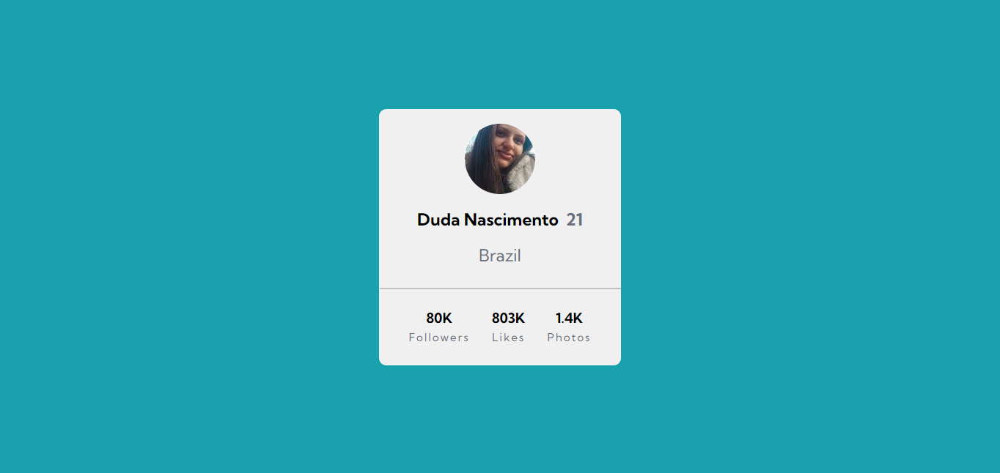
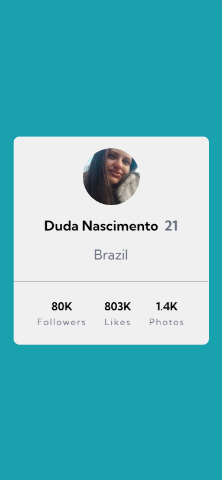

# Profile Card 

## O projeto

O projeto foi inspirado no desafio do Front End Mentor, com algumas alterações.
 
Card de perfil contendo informações pessoais - como foto, nome, imagem e nacionalidade -, e numeros ligados a social midia - seguidores e curtidas.
 

### Requisitos:

- Usar flex-box para posicionar os elementos
- Responsivo

 

*Print do desktop de 1440px*

 

*Para o mobile não foi necessario mediaQuery pois as medidas foram adaptadas para se ajustar a Desktop e Mobile.*

 

## Tecnologias Utilizadas

 

## Autor(a)

 

>Maria Eduarda Nascimento

   